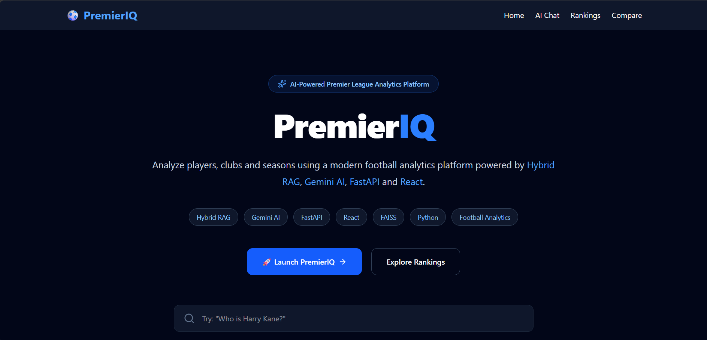
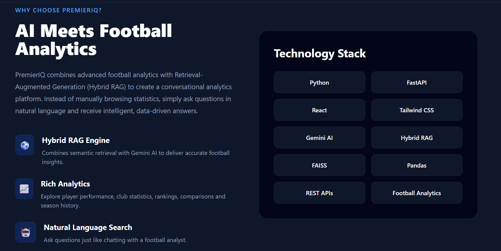
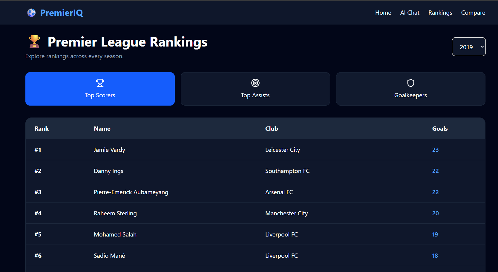

# ⚽ PremierIQ

> **AI-Powered Premier League Analytics Platform built with React, FastAPI, Hybrid RAG, Gemini AI & FAISS**


---

# 📖 Overview

PremierIQ is an AI-powered football analytics platform that enables users to explore English Premier League statistics through an intelligent and interactive interface.

The platform combines structured football analytics with **Hybrid Retrieval-Augmented Generation (Hybrid RAG)**, allowing users to ask natural language questions, compare players, analyze clubs, and explore rankings using AI.

---

# ✨ Features

### 🤖 AI Chat
- Natural language football queries
- Hybrid RAG pipeline
- Gemini AI integration
- FAISS semantic retrieval
- Context-aware football responses

---

### 👤 Player Analytics
- Detailed player profiles
- Goals & assists
- Position
- Nationality
- Market value
- Club information

---

### 🏆 Club Analytics
- Club profiles
- Squad information
- Historical statistics
- Season insights

---

### 📊 Rankings
- Top Scorers
- Top Assists
- Goalkeeper Rankings

---

### ⚖️ Player Comparison
Compare two players using:
- Goals
- Assists
- Matches
- Position
- Club
- Performance statistics

---

### 🔍 Hybrid RAG
PremierIQ combines:

- Football Analytics
- FAISS Vector Search
- Semantic Retrieval
- Gemini AI

to generate intelligent football insights.

---

# 🏗 Architecture

```text
                    React Frontend
                           │
                           ▼
                    FastAPI Backend
                           │
        ┌──────────────────┼──────────────────┐
        │                  │                  │
 Player Analytics    Club Analytics      AI Chat
                                              │
                                              ▼
                                    Question Router
                                              │
                                     Entity Extraction
                                              │
                                     Context Builder
                                              │
                                     FAISS Retriever
                                              │
                                          Gemini AI
                                              │
                                   Football Knowledge Base
```

---

# 🛠 Tech Stack

## Frontend
- React
- Tailwind CSS
- Axios
- React Router
- Lucide React

## Backend
- FastAPI
- Python
- Pandas
- Uvicorn

## AI
- Google Gemini
- Hybrid RAG
- FAISS
- Sentence Transformers

## Data
- Premier League Dataset
- Football Statistics
- CSV Processing

---

# 📸 Application Screenshots

## 🏠 Home Page



---

## ✨ Home Page (Features & Statistics)



---

## 🤖 AI Chat


---

## 📊 Rankings



---

## ⚖️ Player Comparison


---

## 📖 FastAPI Swagger Documentation


---

# 📂 Project Structure

```text
PremierIQ
│
├── frontend/
│   ├── src/
│   ├── components/
│   ├── pages/
│   └── services/
│
├── app/
│   ├── api/
│   ├── analytics/
│   ├── rag/
│   ├── services/
│   └── database/
│
├── data/
├── vector_store/
├── screenshots/
├── requirements.txt
└── README.md
```

---

# 🚀 Installation

## Clone Repository

```bash
git clone https://github.com/manish-jc/PremierIQ.git
```

```bash
cd PremierIQ
```

---

## Backend Setup

Create a virtual environment

```bash
python -m venv venv
```

Activate it

Windows

```bash
venv\Scripts\activate
```

Linux / macOS

```bash
source venv/bin/activate
```

Install dependencies

```bash
pip install -r requirements.txt
```

Run the backend

```bash
uvicorn app.api.main:app --reload
```

Backend

```
http://localhost:8000
```

Swagger

```
http://localhost:8000/docs
```

---

## Frontend Setup

```bash
cd frontend
```

Install dependencies

```bash
npm install
```

Run the application

```bash
npm run dev
```

Frontend

```
http://localhost:5173
```

---

# 📡 API Endpoints

| Endpoint | Description |
|-----------|-------------|
| `/chat` | AI Chat |
| `/player` | Player Analytics |
| `/club` | Club Analytics |
| `/rankings/top-scorers` | Top Scorers |
| `/rankings/top-assists` | Top Assists |
| `/rankings/goalkeepers` | Goalkeeper Rankings |
| `/comparisons/player` | Player Comparison |

---

# 🎯 Future Improvements

- Live Premier League API Integration
- Conversation Memory
- Multi-League Support
- Interactive Visualizations
- Team Performance Dashboard
- Transfer Analytics
- Match Prediction
- Player Recommendation System


# 👨‍💻 Author

## Manish J C

GitHub: https://github.com/manish-jc

LinkedIn: *(Add your LinkedIn profile URL here)*

---

# ⭐ If you enjoyed this project

If you found this project interesting, consider giving it a ⭐ on GitHub!
